# Quality assurance FullStack-Overflow(ers)

## Тестируется -  https://uart.site/

Chromium - Версия 133.0.6943.142 (Официальная сборка), (64 бит)

## Содержание

1. [Правила валидации](#правила-валидации)
2. [Регистрация](#регистрация)
3. [Авторизация](#авторизация)
4. [Navbar](#navbar)
5. [Фильтры и поиск](#фильтры-и-поиск)
6. [Профиль](#профиль)
7. [Список резюме/вакансий в профиле](#список-резюме-и-вакансий-в-профиле)
8. [Избранные вакансии](#избранные-вакансии)
9. [Лента вакансий](#лента-вакансий)
10. [Страница вакансии](#страница-вакансии)
11. [Страница резюме](#страница-резюме)
12. [Страница 404](#страница-404)

### Правила валидации

#### Email

Электронная почта считается валидной, если
* В ней присутствует знак @
* Слева от @ введен присутствует хотя бы один символ, не являющийся @
* Справа от @ введено любое количество (нисколько позволяется) символов, не являющихся @

#### Пароль

Пароль считается валидным, если его длина превосходит 8 символов

#### Имя и Фамилия

Валидным именем или фамилией считается слово (набор букв) на русском или английском языке.

#### Дата рождения

Валидной датой рождения считается дата, удовлетворяющая требованиям:
* Это корректная календарная дата
* С момента этой даты прошло не менее 18 лет

#### Должность

Валидной должностью является любая комбинация символов на русском языке с пробелами и знаками "-".

#### Перевод должности на английский

Валидным переводом считается любая комбинация символов на английском языке с пробелами и знаками "-".

#### Название компании

Валидным названием компании считается любая комбинация символов на русском или английском языках
с пробелами и знаками -, а также кавычками ".

#### Описание компании

Валидным описанием считается любой текст.

#### Сайт компании

Валидным сайтом считается любая строка.

#### Описание и достижения

Валидным пунктом описания и достижений соискателя является любой текст.

#### Опыт работы

Валидным опытом работы является любой текст.

#### Заработная плата

Валидной заработной платой считается любая комбинация цифр (в том числе пустая),
являющаяся положительным целым числом.

#### Город

Валидным городом считается любая строка на русском или английском языках с пробелами и знаками "-".

#### Описание вакансии

Валидным описанием вакансии является любой непустой текст.

#### Образование

Валидным образованием является любой текст.

#### Контакты

Валидными контактами также является любой текст.

#### Аватар

Аватар считается валидным, если это файл формата
png, jpg или jpeg размером меньше 20 Мбайт.

### Регистрация

(входит рекомендация регистрации на главной странице)

### Авторизация

### Navbar

(входят уведомления)

### Фильтры и поиск

1. Все фильтры и поиск находятся [на главной странице](https://uart.site/) и имеют 2 Dropdown элемента "Поиск по" и "В категории" с 4 и 8 вариантами соответственно.

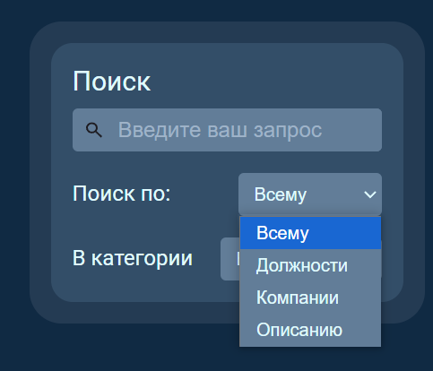

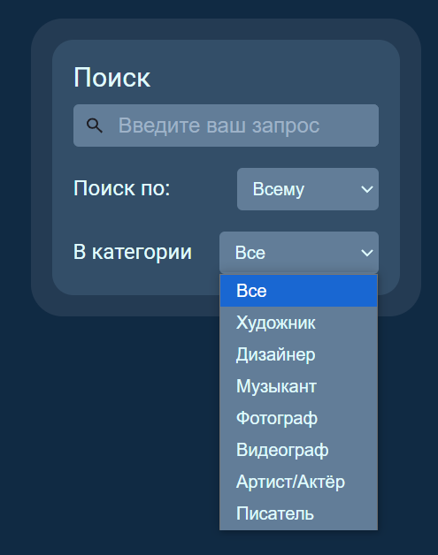

2. При выполнении поиска по пустой строке (нажатии enter в поле поиска) отображается полный список вакансий

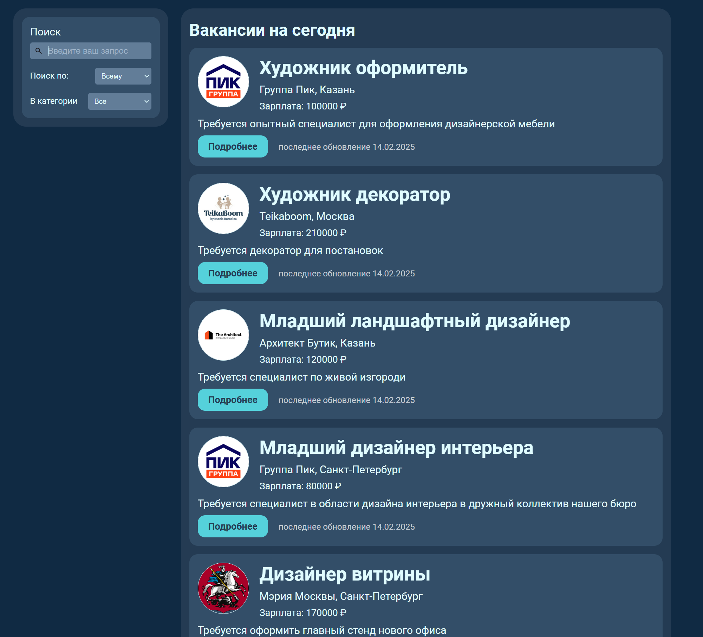

3. При выполнении поиска (нажатии enter в поле поиска) и отсутствии совпадений отображается поисковый запрос пользователя в формате "Вакансии по запросу «*запрос пользователя*»" и ниже надпись "По вашему запросу ничего не найдено"

4. При выполнении поиска (нажатии enter в поле поиска) и нахождении совпадений отображается список совпадений отсортированный от наибольшего совпадения к наименьшему (художник встречается и в названии вакансий и в описании, но выше отображаются вакансии у которых поисковое слово найдено в названии чем те у которых описание (графитист ниже))

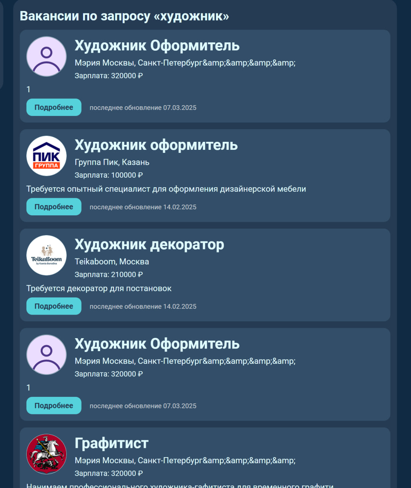
 
Поле ввода не расширяется после превышения его размеров пользователем, далее будет видна только часть строки.

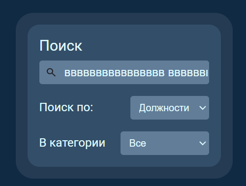

> ${\color{red}Баг}$ \
> 5. Поиск игнорирует служебные части речи, дабы искать только совпадения ключевых слов, что может привести к отсутствию результатов если в поиске использовать только служебные слова, даже те которые встречаются в вакансиях.
>  

6. При одновременном поиске и фильтрации заголовок включает не только поисковый запрос пользователя но и выбранную им категорию, например "Вакансии по запросу «оформитель» в категории «Художник»"
7. Поиск или фильтрация происходят только после нажатия enter в поле поиска

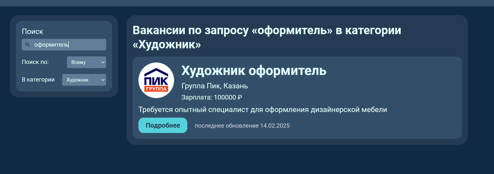

### Профиль

(резюме и избранное не входит)

### Список резюме и вакансий в профиле

### Избранные вакансии

1. В профиле соискателя виден раздел "Избранные вакансии" отображающий список названий вакансий добавленных в избранное
2. При клике на имя вакансии должна открыться страница этой вакансии.

3. При отсутствии избранных вакансий вместо списка имен должна отображаться надпись "Пока ничего нет"

### Лента вакансий

1. Лента должна быть "бесконечной" отображать все доступные вакансии.
2. Список вакансий должен быть отсортирован по дате, наверху вакансии с датой обновления ближе всего к текущей (в том случае если не активирован поиск).

3. У вакансии должно отображаться:
  * Логотип обрезанный до круглой формы
  * Название вакансии
  * Название компании
  * Город поиска вакансии
  * Заработная плата в рублях (или "неизвестно" в случае если работодатель ее не указал)
  * Описание вакансии
  * Кнопка "подробнее" ведущая на [страницу вакансии](https://uart.site/vacancy?id=1)
  * Дата последнего обновления вакансии

> ${\color{red}Баг}$ \
> Если с [главной страницы](https://uart.site/) сайта перейти в [профиль](https://uart.site/me), а потом обратно по этой кнопке, то выгрузятся не все вакансии, а только 5, после обновления страницы в выдаче снова окажутся все вакансии.
> 
> 
> 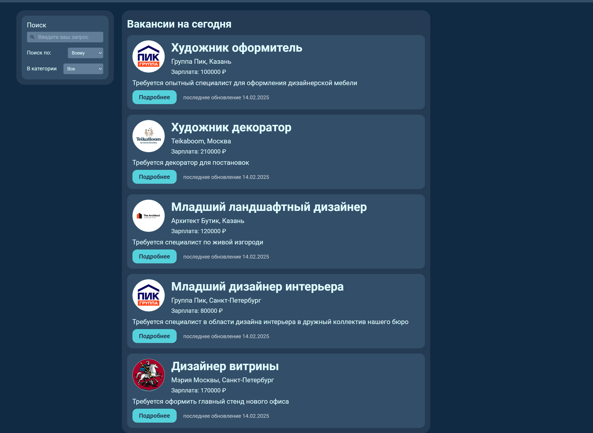
> 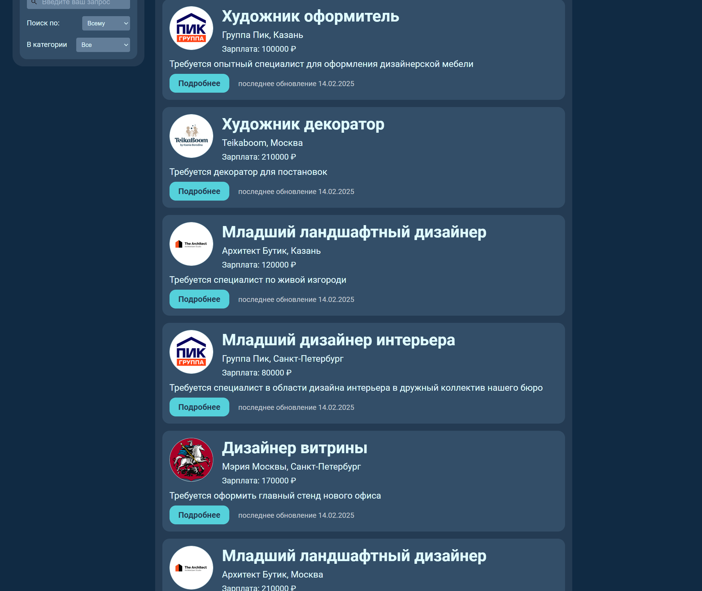

### Страница вакансии

1. Если зайти на страницу [чужой вакансии](https://uart.site/vacancy?id=6) (вакансия созданная другим аккаунтом), то будет
  * дополнительно отображаться тип занятости предлагаемый вакансией "Временная" в этом примере.
  * кнопка "Все вакансии" перенаправляющая на список всех вакансий создателя этой вакансии
  * Информация о работодателе справа от основной, с указанием
    * Имени
    * Фамилии
    * Города
    * Контактов

2. Если зайти на страницу вакансии созданную текущим пользователем то будет
  * возможность изменить вакансию по кнопке "изменить"
  * возможность удалить вакансию по кнопке "удалить"
  * список откликнувшихся на эту вакансию справа под заголовком "Откликнувшиеся", при нажатии на имя и фамилию можно перейти в профиль соискателя

3. Если зайти на страницу вакансии под аккаунтом соискателя то будет доступна
  * кнопка откликнуться

  > ${\color{red}Баг}$
  > * флажок после названия вакансии позволяющий добавить вакансию в избранное (должен отображаться справа сверху от всего поля вакансии а не рядом с текстом названия)
> 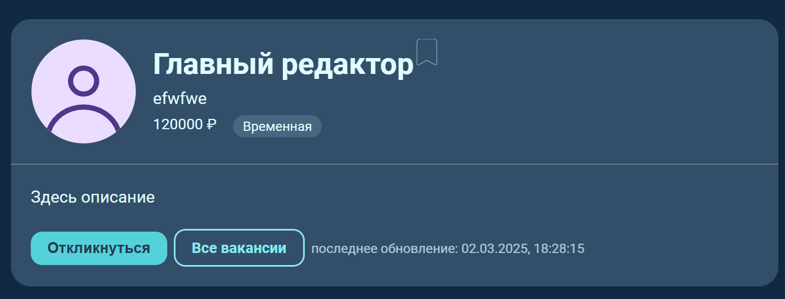

4. После добавления вакансии в избранное флажок должен стать желтым
5. На него можно нажать повторно для удаления вакансии из избранного

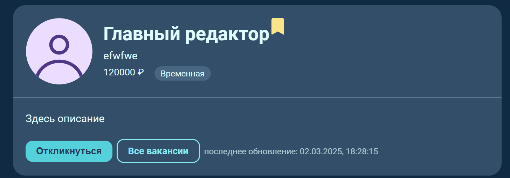

### Страница резюме

### Страница 404

1. При вводе url, роутинг которого не предусмотрен нашим сайтом, на сайте отображается окно c надписью "Ой... Вы попали не туда", с возможностью вернуться на главную страницу через кнопку "Вернуться на главную"

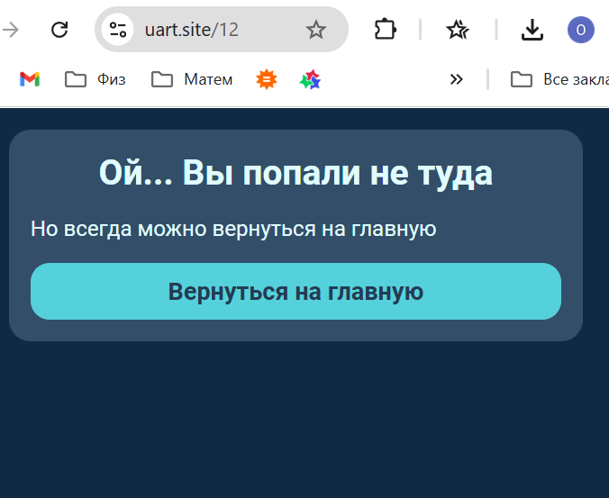

> ${\color{red}Баг}$ \
> Если попробовать попасть на страницу, введя существующий url, содержащий 2 или более "/", в адресную строку, а не через сайт, страница не загрузится. [Например](https://uart.site/cv/new) не загрузится даже 404.
> 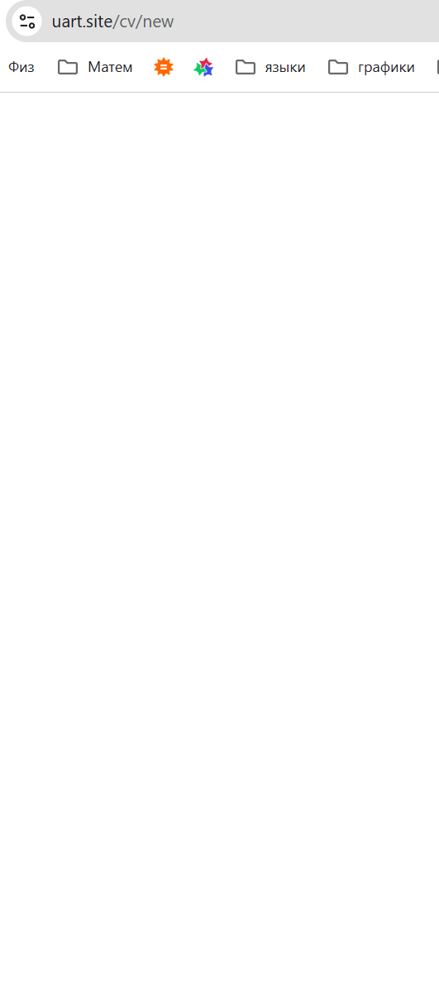
