# Quality assurance FullStack-Overflow(ers)

## Тестируется -  https://uart.site/

Chromium - Версия 133.0.6943.142 (Официальная сборка), (64 бит)

## Содержание

1. [Правила валидации](#правила-валидации)
2. [Регистрация](#регистрация)
3. [Авторизация](#авторизация)
4. [Navbar](#navbar)
5. [Фильтры и поиск](#фильтры-и-поиск)
6. [Профиль](#профиль)
7. [Список резюме/вакансий в профиле](#список-резюме-и-вакансий-в-профиле)
8. [Избранные вакансии](#избранные-вакансии)
9. [Лента вакансий](#лента-вакансий)
10. [Страница вакансии](#страница-вакансии)
11. [Страница резюме](#страница-резюме)

### Правила валидации

### Регистрация

(входит рекомендация регистрации на главной странице)

### Авторизация

### Navbar

(входят уведомления)

### Фильтры и поиск

* Все фильтры и поиск находятся [на главной странице](https://uart.site/) и имеют 2 Dropdown элемента "Поиск по" и "В категории" с 4 и 8 вариантами соответственно.

* При выполнении поиска (нажатии enter в поле поиска) отображается полный список вакансий

* При выполнении поиска (нажатии enter в поле поиска) и отсутствии совпадений отображается поисковый запрос пользователя в формате "Вакансии по запросу «*запрос пользователя*»" и ниже надпись "По вашему запросу ничего не найдено"

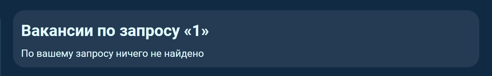

* При выполнении поиска (нажатии enter в поле поиска) и нахождении совпадений отображается список совпадений отсортированный от наибольшего совпадения к наименьшему.

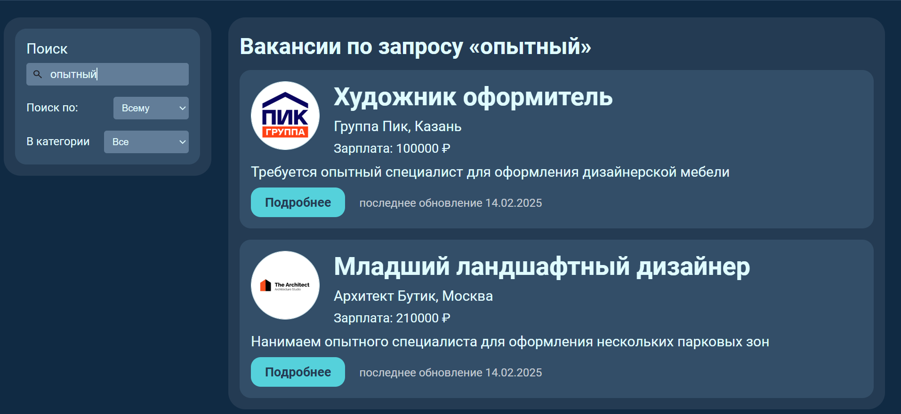

* Баг

При вводе в поиск строки "вввввввввввввв ввввввввв" она выходит за границы поисковой строки и становится невидна, как и любая другая строка большой длинны.

* Не баг а фича - Поиск игнорирует служебные части речи, дабы искать только совпадения ключевых слов, что может привести к отсутствию результатов если в поиске использовать только служебные слова, даже те которые встречаются в вакансиях.

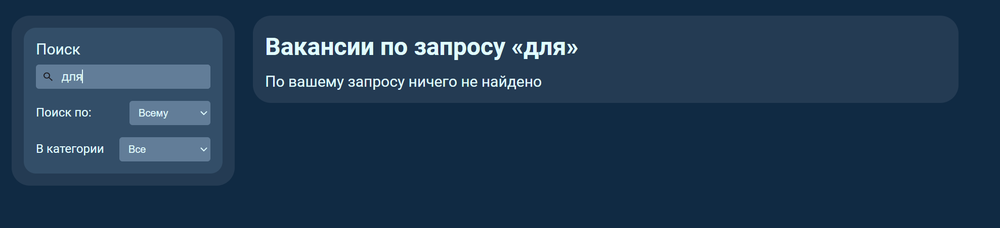

* При одновременном поиске и фильтрации заголовок должен включать не только поисковый запрос пользователя но и выбранную им категорию, например "Вакансии по запросу «оформитель» в категории «Художник»"

### Профиль

(резюме и избранное не входит)

### Список резюме и вакансий в профиле

### Избранные вакансии

* В профиле соискателя должен быть раздел "Избранные вакансии" отображающий список названий вакансий добавленных в избранное
* При клике на имя вакансии должна открыться страница этой вакансии.

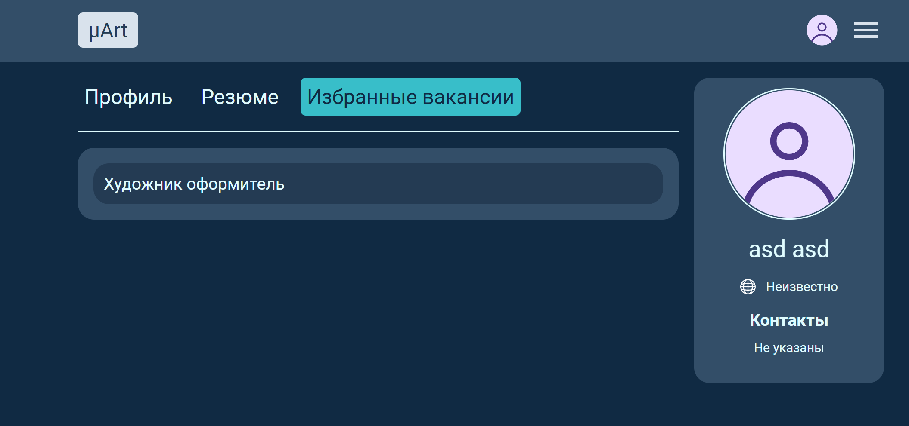

* При отсутствии избранных вакансий вместо списка имен должна отображаться надпись "Пока ничего нет"

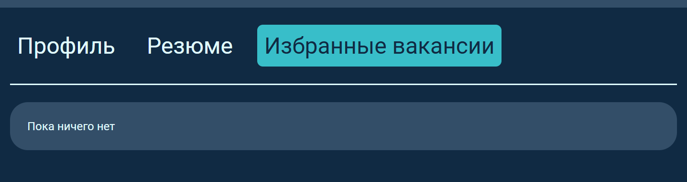

### Лента вакансий

* Лента должна быть "бесконечной" отображать все доступные вакансии и иметь scrollbar справа.
* Список вакансий должен быть отсортирован по дате, наверху вакансии с датой обновления ближе всего к текущей.

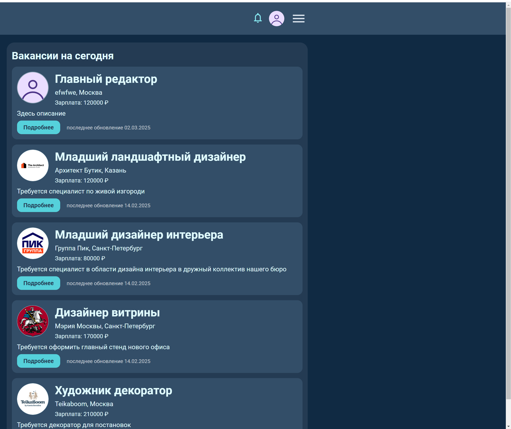

* У вакансии должно отображаться:
  * Логотип обрезанный до круглой формы
  * Название вакансии
  * Название компании
  * Город поиска вакансии
  * Заработная плата в рублях
  * Описание вакансии
  * Конопка "подробнее" ведущая на [страницу вакансии](https://uart.site/vacancy?id=1)
  * Дата последнего обновления вакансии

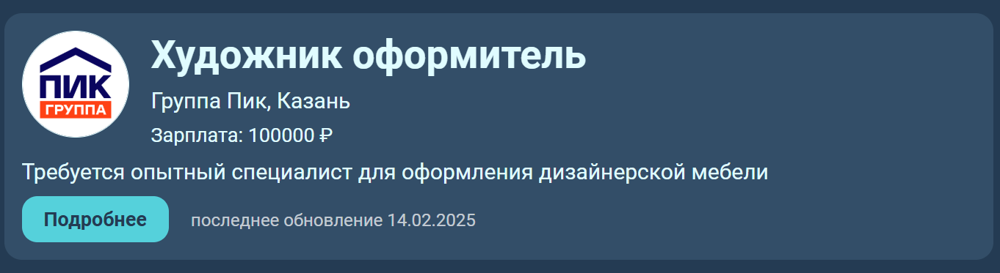

* Баг

Если с [главной страницы](https://uart.site/) сайта перейти в [профиль](https://uart.site/me), а потом обратно по этой кнопке, то выгрузятся не все вакансии, а только 5, после обновления страницы в выдаче снова окажутся все вакансии.
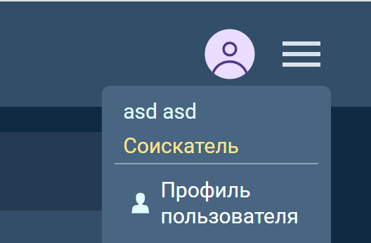

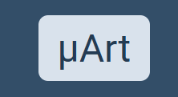

### Страница вакансии

* Если зайти на страницу [чужой вакансии](https://uart.site/vacancy?id=6), то будет
  * дополнительно отображаться тип занятости предлагаемый вакансией "Временная" в этом примере.
  * кнопка "Все вакансии" перенаправляющая на список всех вакансий создателя этой вакансии
  * Информация о работодателе справа от основной, с указанием
    * Имени
    * Фамилии
    * Города
    * Контактов

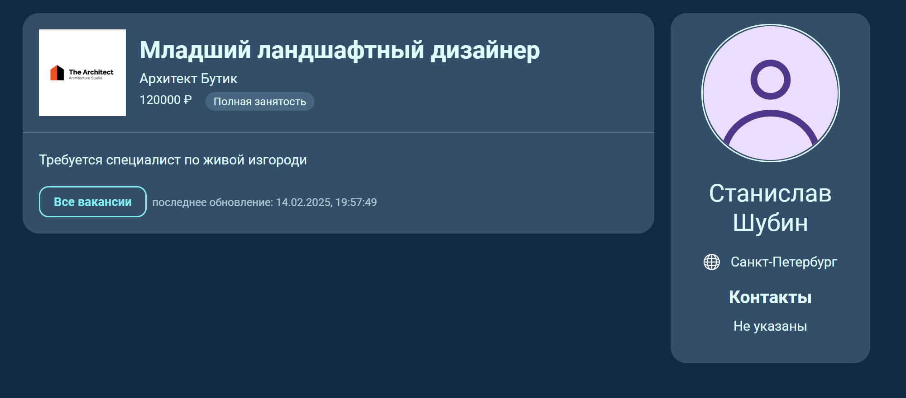

* Если зайти на страницу вакансии созданную текущим пользователем то будет
  * возможность изменить вакансию по кнопке "изменить"
  * возможность удалить вакансию по кнопке "удалить"
  * Список откликнувшихся на эту вакансию справа под заголовком "Откликнувшиеся"

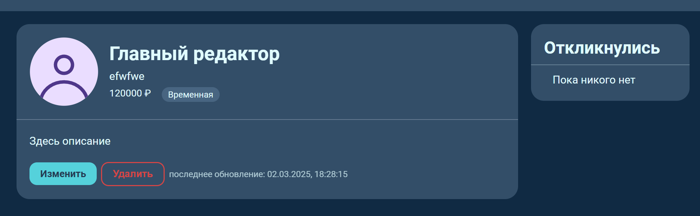

* Если зайти на страницу вакансии под аккаунтом соискателя то будет доступна
  * кнопка откликнуться
  * Флажок после названия вакансии позволяющий добавить вакансию в избранное

* После добавления вакансии в избранное флажок должен стать желтым
* На него можно нажать повторно для удаления вакансии из избранного

### Страница резюме
