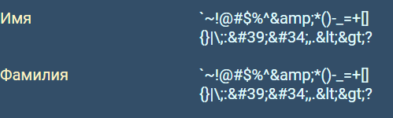

# Quality assurance FullStack-Overflow(ers)

## Тестируется -  https://uart.site/

Chromium - Версия 133.0.6943.142 (Официальная сборка), (64 бит)

## Содержание

1. [Правила валидации](#правила-валидации)
2. [Регистрация](#регистрация)
3. [Авторизация](#авторизация)
4. [Navbar](#navbar)
5. [Фильтры и поиск](#фильтры-и-поиск)
6. [Профиль](#профиль)
7. [Список резюме/вакансий в профиле](#список-резюме-и-вакансий-в-профиле)
8. [Избранные вакансии](#избранные-вакансии)
9. [Лента вакансий](#лента-вакансий)
10. [Страница вакансии](#страница-вакансии)
11. [Страница резюме](#страница-резюме)

### Правила валидации

#### Email

Электронная почта считается валидной, если
* В ней присутствует знак @
* Слева от @ введен присутствует хотя бы один символ, не являющийся @
* Справа от @ введено любое количество (нисколько позволяется) символов, не являющихся @

#### Пароль

Пароль считается валидным, если его длина превосходит 8 символов

#### Имя и Фамилия

Валидным именем или фамилией считается слово (набор букв) на русском или английском языке.

#### Дата рождения

Валидной датой рождения считается дата, удовлетворяющая требованиям:
* Это корректная календарная дата
* С момента этой даты прошло не менее 18 лет

#### Должность

Валидной должностью является любая комбинация символов на русском языке с пробелами и знаками "-".

#### Перевод должности на английский

Валидным переводом считается любая комбинация символов на английском языке с пробелами и знаками "-".

#### Название компании

Валидным названием компании считается любая комбинация символов на русском или английском языках
с пробелами и знаками -, а также кавычками ".

#### Описание компании

Валидным описанием считается любой текст.

#### Сайт компании

Валидным сайтом считается любая строка.

#### Описание и достижения

Валидным пунктом описания и достижений соискателя является любой текст.

#### Опыт работы

Валидным опытом работы является любой текст.

#### Заработная плата

Валидной заработной платой считается любая комбинация цифр (в том числе пустая),
являющаяся положительным целым числом.

#### Город

Валидным городом считается любая строка на русском или английском языках с пробелами и знаками "-".

#### Описание вакансии

Валидным описанием вакансии является любой непустой текст.

#### Образование

Валидным образованием является любой текст.

#### Контакты

Валидными контактами также является любой текст.

#### Аватар

Аватар считается валидным, если это файл формата
png, jpg или jpeg размером меньше 20 Мбайт.

### Регистрация

(входит рекомендация регистрации на главной странице)

### Авторизация

### Navbar

(входят уведомления)

### Фильтры и поиск

### Профиль

(резюме и избранное не входит)

Страница профиля текущего пользователя: https://uart.site/me  
Страница профиля соискателя: https://uart.site/profile?id=1&userType=applicant  
Страница профиля работодателя: https://uart.site/profile?id=1&userType=employer  

1. Для только что зарегистрированного соискателя на странице отображается следующая информация:
    * Имя
    * Фамилия
    * Дата рождения (завист от локали)
    * Образование (изначально пустое)  

    Для работодателя она содержит:  
    * Имя  
    * Фамилия  
    * Должность  
    * Компания   
    * Описание компании  
    * Сайт компании

    Карточка в правой части экрана с иконкой и кратким описанием пользователя
(фамилия, имя, город и контакты) также имеет незаполненные город и контакты.

2. При нажатии на кнопку "Редактировать" открывается форма для редактирования информации о пользователе, а именно:  
    1. Имя
    2. Фамилия
    3. Город
    4. Дата рождения (только для соискателя)
    5. Образование (только для соискателя)
    6. Контакты
    7. Аватар

3. Нажатие на кнопку "Отменить" отменяет все внесённые изменения и закрывает форму.  

4. При нажатии на "Сохранить", внесенные изменения сохраняются, а форма редактирования профиля закрывается  

>  $\text{\color{red}Баг}$  
>  После сохранения изменений без добавления нового аватара стандартная картинка "слетает".
>  Перезагрузка страницы возвращает стандартную картинку.

4. Максимальная допустимая длина полей в форме:
    * для имени, фамилии и города - 50 символов
    * для образования и контактов - 500 символов

>  $\text{\color{red}Баг}$  
>  При заполнении 500 символами полей "Образование" или "Контакты" отображается сообщение
о непредвиденной ошибке.

       

5. При введении некорректной календарной даты, например 31.02.1999, отображается сообщение, что дата некорректна.

>  $\text{\color{red}Баг}$  
>  На самом деле, в этом случае возниакет сообщение, что нужно заполнить поле.
Сохранить изменения с такой датой нельзя.

6. При введении длинных данных (порядка 50 символов), интерфейс адаптируется под введенные данные 

>  $\text{\color{red}Баг}$  
>  В реальности, происходит переполнение контейнеров.

7. Можно добавить аватар пользователя, соответсвующую требованиям к [валидации изображений](#равила-валидации)

>  $\text{\color{red}Баг}$  
>  В действительности, даже png фотографию размером чуть более 6 МБ отправить не удается.

8. При попытке отправить слишком большой файл (>20 МБ), ожидается получение сообщения
об ошибке.

>  $\text{\color{red}Баг}$  
>  Никакого сообщения о том, что файл слишком большой не отображается. После нажатия 
на "Сохранить" форма редактирования не закрывается.

9. При попытке отправить файл формата, отличного от png или jpg, всплывает сообщение о неверном формате.

10. Ожидается, что имя, фамилия и город валидируются согласно [правилам валидации](#правила-валидации)

>  $\text{\color{red}Баг}$  
>  В действительности, имя, фамилия и город могут содержать символы `~!@#$%^&*()-_=+[]{}|\;:'",.<>?

11. Возраст, согласно введённой дате рождения должен [валидироваться](#правила-валидации), на то, что пользователь старше 18 лет.

>  $\text{\color{red}Баг}$  
>  Возраст может быть менее 18 лет

12. Дата рождения не должна принимать даты из будущего

>  $\text{\color{red}Баг}$  
>  Дата рождения может быть в будущем

13. Поля "образование" и "контакты" могут содержать любой текст

14. После изменения данных профиля работодателя в форме, должны измениться и данные на самой странице профиля

>  $\text{\color{red}Баг}$  
>  Изменённые данные без ручной перезагрузки страницы не обновляются

15. Можно добавлять аватар работодателя

>  $\text{\color{red}Баг}$  
>  Попытка добавления фотографии допустимых параматеров вызывает ошибку.

16. Не допускается оставлять пустыми поля имени и фамилии

### Список резюме и вакансий в профиле

### Избранные вакансии

### Лента вакансий

### Страница вакансии

### Страница резюме
