# Quality assurance FullStack-Overflow(ers)

## Объект тестирования

Тестируется -  https://uart.site/

Chromium - Версия 133.0.6943.142 (Официальная сборка), (64 бит)

## Содержание

<!-- mtoc-start -->

* [Правила валидации](#правила-валидации)
  * [Email](#email)
  * [Пароль](#пароль)
  * [Имя и Фамилия](#имя-и-фамилия)
  * [Дата рождения](#дата-рождения)
  * [Должность](#должность)
  * [Перевод должности на английский](#перевод-должности-на-английский)
  * [Название компании](#название-компании)
  * [Описание компании](#описание-компании)
  * [Сайт компании](#сайт-компании)
  * [Описание и достижения](#описание-и-достижения)
  * [Опыт работы](#опыт-работы)
  * [Заработная плата](#заработная-плата)
  * [Город](#город)
  * [Описание вакансии](#описание-вакансии)
  * [Образование](#образование)
  * [Контакты](#контакты)
  * [Аватар](#аватар)
* [Регистрация](#регистрация)
  * [Общие проверки (для обоих типов пользователей)](#общие-проверки-для-обоих-типов-пользователей)
  * [Форма регистрации соискателя](#форма-регистрации-соискателя)
  * [Форма регистрации работодателя](#форма-регистрации-работодателя)
  * [Приглашение пользователя зарегистрироваться](#приглашение-пользователя-зарегистрироваться)
* [Авторизация](#авторизация)
* [Navbar](#navbar)
  * [Общие проверки](#общие-проверки)
  * [Navbar неавторизованного пользователя](#navbar-неавторизованного-пользователя)
  * [Navbar авторизованного пользователя](#navbar-авторизованного-пользователя)
  * [Navbar соискателя](#navbar-соискателя)
  * [Navbar работодателя](#navbar-работодателя)
* [Фильтры и поиск](#фильтры-и-поиск)
* [Профиль](#профиль)
* [Список резюме и вакансий в профиле](#список-резюме-и-вакансий-в-профиле)
  * [Список вакансий](#список-вакансий)
  * [Список резюме](#список-резюме)
* [Избранные вакансии](#избранные-вакансии)
* [Лента вакансий](#лента-вакансий)
* [Страница вакансии](#страница-вакансии)
* [Страница резюме](#страница-резюме)
* [Страница 404](#страница-404)

<!-- mtoc-end -->

## Правила валидации

### Email

Электронная почта считается валидной, если
* В ней присутствует знак @
* Слева от @ введен присутствует хотя бы один символ, не являющийся @
* Справа от @ введено любое количество (нисколько позволяется) символов, не являющихся @

### Пароль

Пароль считается валидным, если его длина превосходит 8 символов

### Имя и Фамилия

Валидным именем или фамилией считается слово (набор букв) на русском или английском языке.

### Дата рождения

Валидной датой рождения считается дата, удовлетворяющая требованиям:
* Это корректная календарная дата
* С момента этой даты прошло не менее 18 лет

### Должность

Валидной должностью является любая комбинация символов на русском языке с пробелами и знаками "-".

### Перевод должности на английский

Валидным переводом считается любая комбинация символов на английском языке с пробелами и знаками "-".

### Название компании

Валидным названием компании считается любая комбинация символов на русском или английском языках
с пробелами и знаками -, а также кавычками ".

### Описание компании

Валидным описанием считается любой текст.

### Сайт компании

Валидным сайтом считается любая строка.

### Описание и достижения

Валидным пунктом описания и достижений соискателя является любой текст.

### Опыт работы

Валидным опытом работы является любой текст.

### Заработная плата

Валидной заработной платой считается любая комбинация цифр (в том числе пустая),
являющаяся положительным целым числом.

### Город

Валидным городом считается любая строка на русском или английском языках с пробелами и знаками "-".

### Описание вакансии

Валидным описанием вакансии является любой непустой текст.

### Образование

Валидным образованием является любой текст.

### Контакты

Валидными контактами также является любой текст.

### Аватар

Аватар считается валидным, если это файл формата
png, jpg или jpeg размером меньше 20 Мбайт.

## Регистрация

### Общие проверки (для обоих типов пользователей)

1. Наведение на вариант radiobutton типа пользователя 
   красит этот вариант в белый цвет.

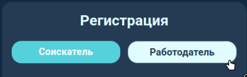

2. Переключение типа пользователя через radiobutton
   меняет форму регистрации на соответствующую выбранному типу.

3. Поля "Имя", "Фамилия", "Электронная почта", "Пароль", "Повторите пароль",
   являющиеся общими для обоих типов пользователей, не меняют содержимое
   при переключении типа пользователя.

4. Все поля формы сохраняют содержимое при переключении типа
   пользователя.

5. Все поля формы обладают Just In Time (JIT) валидацией, а именно при
   каждом снятии фокуса с input'а, соответствующий input валидирует
   введенные данные или те данные, которые уже были введены до этого.

6. Все поля формы ограниченны по длине ввода: input не более 50 символов,
   textarea - не более 500.

6. Валидно заполненный input подсвечивается зеленым цветом

7. Невалидно заполненный input подсвечивается красным цветом

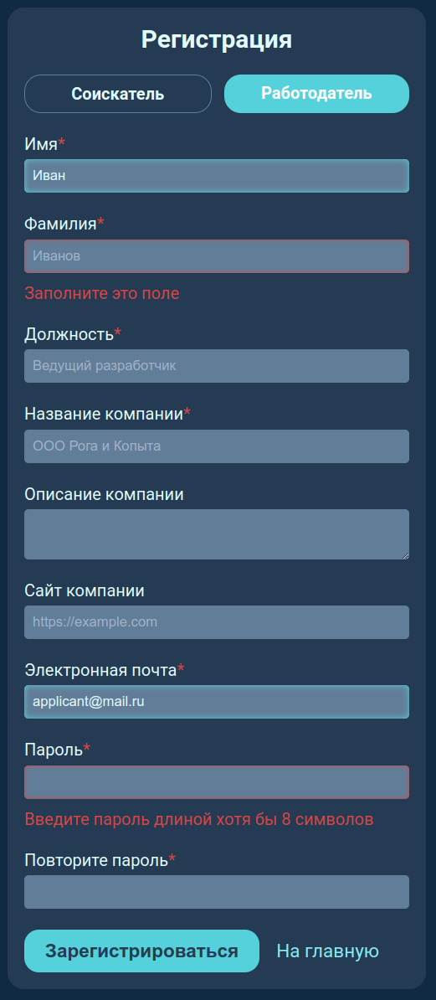
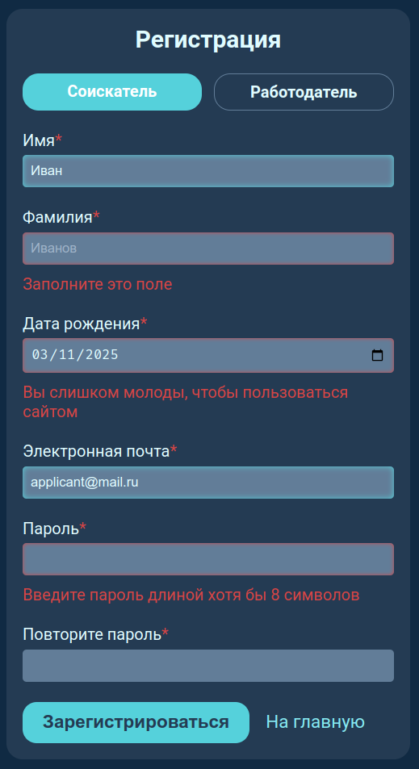

8. Нажатие кнопки "На главную", переводит пользователя на главную
   страницу (https://uart.site)

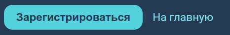

9. Поле имени позволяет ввести слово на русском языке

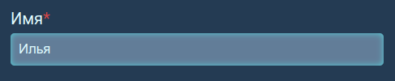

10. Поле имени позволяет ввести слово на английском языке

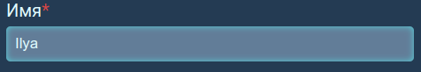

11. Поле имени не позволяет вводить более одного слова

> $\color{red}Баг$
> Поле имени позволяет вводить более одного слова

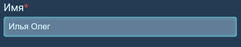

12. Поле имени не позволяет вводить запрещенные
   [правилами валидации](#правила-валидации) символы.

> $\color{red}Баг$
> Поле имени позволяет вводить любые символы

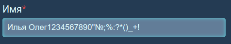

13. Поле фамилии позволяет ввести слово на русском языке

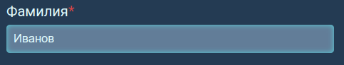

14. Поле фамилии позволяет ввести слово на английском языке

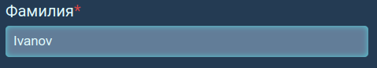

15. Поле фамилии не позволяет вводить более одного слова

> $\color{red}Баг$
> Поле фамилии позволяет вводить более одного слова

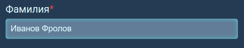

16. Электронная почта "aboba" не является корректной

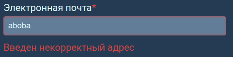

17. Электронная почта "a@" является корректной

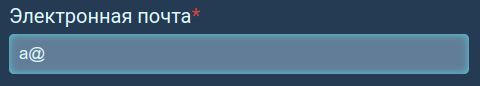

18. Электронная почта "@" не является корректной

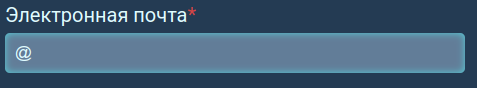

19. Электронная почта "a@mail.ru" является корректной

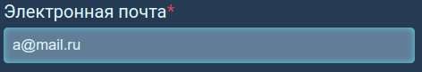

20. Пароль менее 8 символов не является корректным для
   input "Пароль" и помечается сообщением
   "Введите пароль длиной хотя бы 8 символов"

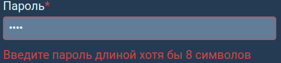

21. Поле "Повторите пароль" при вводе пароля, отличного
   от пароля в поле "Пароль", указывает сообщение об
   ошибке.

> $\color{red}Баг$
> Поле "Повторите пароль" не реагирует на поле "Пароль" ни
> при изменении самого поля "Пароль", ни при изменении
> поля "Повторите пароль"

22. Нажатие на кнопку "Зарегистрироваться" при наличии
   некорректного ввода ничего не делает.

23. Нажатие на кнопку "Зарегистрироваться" при успешной
   регистрации логинит нового пользователя.

24. Нажатие на кнопку "Зарегистрироваться" при успешной
   регистрации переводит пользователя на главную
   страницу (https://uart.site).

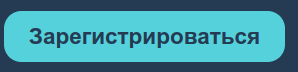

25. Нажатие на кнопку "Зарегистрироваться" при ошибке
   (пользователь оффлайн) выводит снизу по центру экрана
   "Произошла сетевая ошибка, повторите позднее".

### Форма регистрации соискателя

Обязательными полями этой формы являются:
* Имя
* Фамилия
* Дата рождения
* Электронная почта
* Пароль
* Повторите пароль

1. Все обязательные поля формы помечены красным символом
   астериска (*).

2. JIT-валидация каждое незаполненное поле из обязательных
   помечает его сообщением об ошибке "Заполните это поле".

> $\color{red}Баг$
> Для поля "Электронная почта" JIT валидация для пустого ввода
> пишет "Введен некорректный адрес".

> $\color{red}Баг$
> Для поля "Пароль" JIT валидация для пустого ввода пишет
> "Введите пароль длиной хотя бы 8 символов"

> $\color{red}Баг$
> Для поля "Дата рождения" JIT валидация для пустого ввода пишет
> "Введена некорректная дата"

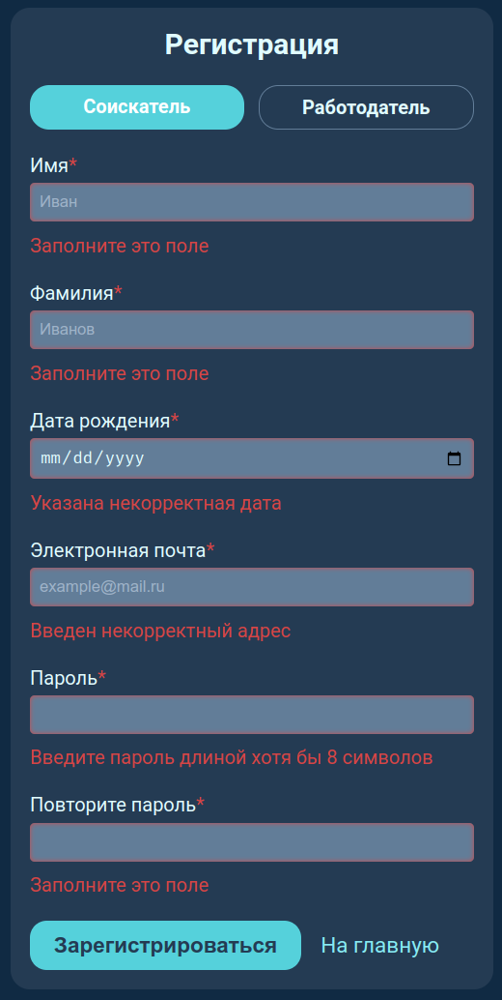

3. Поле "Дата рождения" для ввода даты из будущего
  (2026-01-01) указывает сообщение "Вы слишком молоды, чтобы
   пользоваться сайтом".

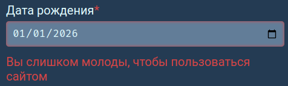

4. Поле "Дата рождения" для ввода даты из прошлого, с момента
   которой прошло менее 18 лет, указывает сообщение
   "Вы слишком молоды, чтобы пользоваться сайтом".

5. Поле "Дата рождения" пропускает корректную с точки зрения
   [правил валидации](#правила-валидации) дату (2001-01-01).

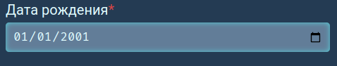

### Форма регистрации работодателя

Обязательными полями этой формы являются:
* Имя
* Фамилия
* Должность
* Название компании
* Описание компании
* Электронная почта
* Пароль
* Повторите пароль

1. Все обязательные поля формы помечены красным символом
   астериска (*).

2. JIT-валидация каждое незаполненное поле из обязательных
   помечает его сообщением об ошибке "Заполните это поле".

3. JIT-валидация не помечает ошибками
   каждое незаполненное поле из неявляющихся
   обязательными.

> $\color{red}Баг$
> Для поля "Электронная почта" JIT валидация для пустого ввода
> пишет "Введен некорректный адрес".

> $\color{red}Баг$
> Для поля "Пароль" JIT валидация для пустого ввода пишет
> "Введите пароль длиной хотя бы 8 символов"

4. Должность, удовлетворяющая [правилам валидации](#правила-валидации),
   не вызывает ошибок (Ведущий инженер-программист)

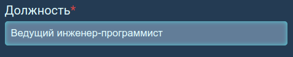

5. Должность, содержащая хотя бы один из запрещенных символов, помечается
   ошибкой "Введите свою должность на русском языке"

> $\color{red}Баг$
> Input должности считает корректным любой ввод

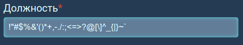

6. Название компании, удовлетворяющее [правилам валидации](#правила-валидации),
   не вызывает ошибок (ООО "Рога и Копыта", Wolf-softworks)

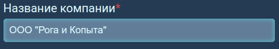
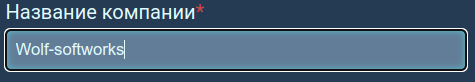

7. Некорректное название компании помечается ошибкой "Введите название компании на
   русском или английском языке"

> $\color{red}Баг$
> Некорректное название компании (!"#$%&'()*+,-./:;<=>?@[\]^_{|}~`) пропускается как валидное

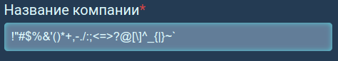

8. Input "Описание компании" позволяет ввести любой текст.

> $\color{red}Баг$
> Input "Описание компании" может неограниченно увеличиваться пользователем
> до произвольных размеров.  
> 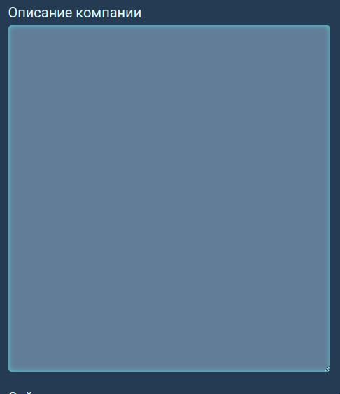

9. Input "Сайт компании" позволяет ввести любую строку.

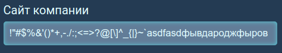

### Приглашение пользователя зарегистрироваться

1. Приглашение отображается на главной странице *только* для
   неавторизованного пользователя

2. Нажатие на кнопку "регистрация" переводит на страницу
   регистрации (https://uart.site/registration).

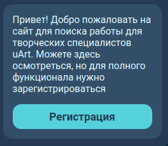

## Авторизация

Рассматривается страница авторизации (https://uart.site/login). Валидность и
невалидность понимается в том смысле, как указано в начале отчета.

1. По *центру* страницы располагается форма с заголовком "Вход в аккаунт"

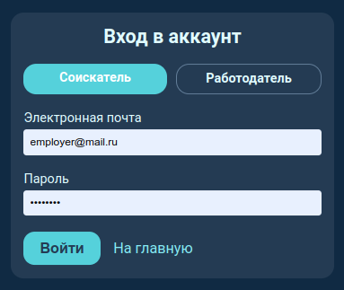

2. Вариант radiobutton соискатель-работодатель, на который наведен курсор
   пользователя, подсвечивается белым.

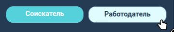

3. Radiobutton корректно переключается (его состояние меняется, активное состояние
   выделено голубым цветом)

4. Нажатие кнопки "На главную" переводит на главную страницу (https://uart.site/)

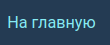

5. При наличии пустых полей в форме нажатие на кнопку "Войти" подписывает каждое пустое
   поле надписью "Заполните это поле"

6. Невалидные поля при нажатии на кнопку "Войти" подсвечиваются красным цветом

7. Валидные поля при нажатии на кнопку "Войти" подсвечиваются зеленым цветом

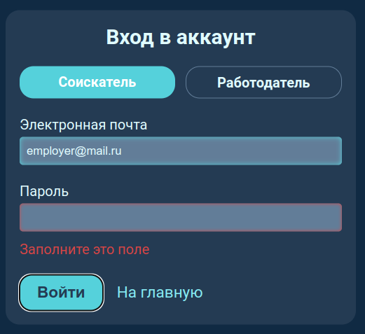

8. Невалидный email-адрес (aboba) подписывается при нажатии на кнопку "Войти"
   красной надписью "Введен некорректный адрес"

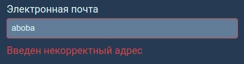

9. Email "@" не является валидным.

10. Email "a@" является валидным.

11. Email "@a" не является валидным.

12. Email "' '@a" является валидным.

13. При вводе неправильных (почта верная, не тот тип пользователя или пароль) или несуществующих
   данных входа и нажатии на кнопку
   "Войти", внизу по центру экрана появляется уведомление "Пользователь с такой почтой и
   паролем не найден"

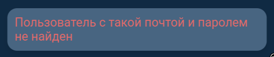

14. При вводе правильных (почта и пароль верные) данных входа
   и нажатии на кнопку "Войти", внизу по центру
   экрана появляется уведомление "Вы успешно вошли"

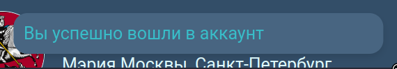

15. При вводе правильных данных входа и нажатии на кнопку "Войти", пользователь
   переводится на главную страницу (https://uart.site)

16. Авторизованный пользователь не может попасть на страницу логина. Переход на
   неё явно в адресной строке редиректит на главную страницу (https://uart.site)

## Navbar

### Общие проверки

1. Navbar присутствует *только* на страницах:
   * Главная страница (https://uart.site)
   * Страница профиля (https://uart.site/profile?id=1&userType=employer)
   * Страница моего профиля (https://uart.site/me)
   * Страница вакансии (https://uart.site/vacancy?id=1)
   * Страница резюме (https://uart.site/cv?id=1)

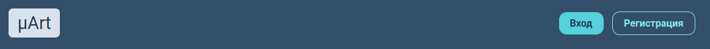
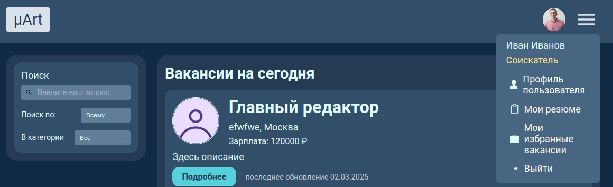
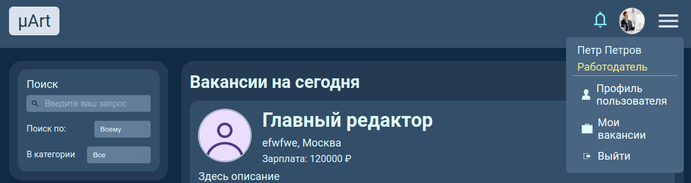

2. Нажатие на логотип "μArt" переводит на главную страницу (https://uart.site)

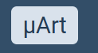

### Navbar неавторизованного пользователя

1. Нажатие на кнопку "Вход" переводит на страницу логина (https://uart.site/login)

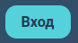

2. Нажатие на кнопку "Регистрация" переводит на страницу регистрации (https://uart.site/registration)

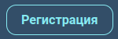

### Navbar авторизованного пользователя

1. Navbar отображает аватар пользователя, если аватар пользователя установлен.

2. Navbar отображает стандартный аватар, если аватар пользователя не установлен.

3. Кнопка вызова бургер-меню подсвечивается при наведении

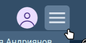

4. Нажатие на кнопку вызова бургер-меню вызывает меню, повторное нажатие скрывает меню

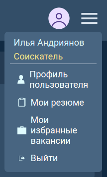

5. Нажатие в любое место экрана, кроме самого бургер-меню, при открытом бургер-меню скрывает его

>  $\text{\color{red}Баг}$  
>  На самом деле нажание на любое место экрана не скрывает бургер-меню.

6. Переход по ссылке скрывает открытое бургер-меню

>  $\text{\color{red}Баг}$  
>  Переход по ссылке не скрывает открытое бургер-меню. Только обновление страницы скрывает.

7. В бургер-меню отображается информация о пользователе: его имя, фамилия,
   надпись "соискатель" для соискателя и "работодатель" для работодателя

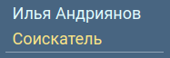
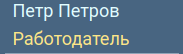

8. Бургер-меню имеет кнопку "Выйти".

9. Нажатие на кнопку "Выйти" приводит к выходу пользователя из аккаунта.
   При успешном выходе внизу по центру экрана появляется уведомление
   "Вы успешно вышли из аккаунта".

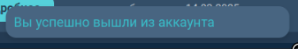

10. Неуспешный выход, полученный нажатием на кнопку "Выйти", если пользователь оффлайн,
    сопровождается уведомлением: "Произошла сетевая ошибка, повторите позднее"

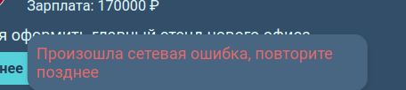

11. Все кнопки бургер-меню подсвечиваются при наведении

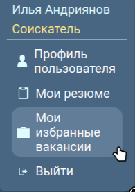

### Navbar соискателя

1. Бургер-меню соискателя имеет ссылки на
   * Профиль пользователя (https://uart.site/me)
   * Мои резюме (https://uart.site/me?from=cvList)
   * Мои избранные вакансии (https://uart.site/me?vacancyList)

Нажатие на ссылки переводит на соответствующую страницу.

### Navbar работодателя

1. Бургер-меню работодателя имеет ссылки на
   * Профиль пользователя (https://uart.site/me)
   * Мои вакансии (https://uart.site/me?from=vacancyList)

2. Navbar работодателя имеет кнопку уведомлений

3. Кнопка уведомлений подсвечивается при наведении

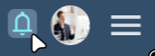

4. Нажатие на кнопку уведомлений открывает список уведомлений или
   закрывает список, если тот открыт

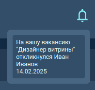

5. Нажатие на любое место экрана, кроме открытого списка уведомлений,
   закрывает его

>  $\text{\color{red}Баг}$  
>  На самом деле нажание на любое место экрана не скрывает список уведомлений.

6. Переход по ссылкам закрывает открытый список уведомлений

>  $\text{\color{red}Баг}$  
>  Навигация по ссылкам оставляет список уведомлений в том состоянии, в котором он был.

7. Выход из аккаунта закрывает список уведомлений

8. Список уведомлений отображает уведомления

9. Просмотренные уведомления путем открытия списка не показываются при его повторном открытии

>  $\text{\color{red}Баг}$  
>  Просмотренные уведомления остаются в списке и не скрываются.

10. Список уведомлений при отсутствии уведомлений отображает надпись "Новых уведомлений нет"

## Фильтры и поиск

1. Все фильтры и поиск находятся [на главной странице](https://uart.site/) и имеют 2 Dropdown элемента "Поиск по" и "В категории" с 4 и 8 вариантами соответственно.

2. При выполнении поиска по пустой строке (нажатии enter в поле поиска) отображается полный список вакансий

3. При выполнении поиска (нажатии enter в поле поиска) и отсутствии совпадений отображается поисковый запрос пользователя в формате "Вакансии по запросу «*запрос пользователя*»" и ниже надпись "По вашему запросу ничего не найдено"

4. При выполнении поиска (нажатии enter в поле поиска) и нахождении совпадений отображается список совпадений, отсортированный от наибольшего приоритета к наименьшему.
  * Вакансия с большим количеством совпадений будет выше вакансии с меньшим количеством совпадений
  * Вакансия с совпадением в названии вакансии будет выше вакансии с совпадением в описании
  * Вакансия опубликованная позже будет отображаться выше вакансии опубликованной раньше
  (четвертая вакансия занимает это место, потому что у нее на одно совпадение меньше, в категории - указано дизайнер, а не художник, как у вакансий выше)  

 
5. Поле ввода не расширяется после превышения его размеров пользователем, далее будет видна только часть строки.

> ${\color{red}Баг}$ \
> 6. Поиск игнорирует служебные части речи, дабы искать только совпадения ключевых слов (слов из поискового запроса за исключением служебных частей речи), что может привести к отсутствию результатов если в поиске использовать только служебные слова, даже те которые встречаются в вакансиях.  
>  

7. При одновременном поиске и фильтрации заголовок ленты вакансий включает не только поисковый запрос пользователя, но и выбранную им категорию, например "Вакансии по запросу «оформитель» в категории «Художник»"
8. Поиск или фильтрация происходят только после нажатия enter в поле поиска
9. В поиск можно ввести любую строку  

## Профиль

(резюме и избранное не входит)

Страница профиля текущего пользователя: https://uart.site/me  
Страница профиля соискателя: https://uart.site/profile?id=1&userType=applicant  
Страница профиля работодателя: https://uart.site/profile?id=1&userType=employer  

1. Для только что зарегистрированного соискателя на странице отображается следующая информация:
    * Имя
    * Фамилия
    * Дата рождения (зависит от локали)
    * Образование (изначально пустое)  

    Для работодателя она содержит:  
    * Имя  
    * Фамилия  
    * Должность  
    * Компания   
    * Описание компании  
    * Сайт компании

    Карточка в правой части экрана с иконкой и кратким описанием пользователя
(фамилия, имя, город и контакты) также имеет незаполненные город и контакты.

2. При нажатии на кнопку "Редактировать" открывается форма для редактирования информации о пользователе, а именно:  
    1. Имя
    2. Фамилия
    3. Город
    4. Дата рождения (только для соискателя)
    5. Образование (только для соискателя)
    6. Контакты
    7. Аватар

3. Нажатие на кнопку "Отменить" отменяет все внесённые изменения и закрывает форму.  

4. При нажатии на "Сохранить", внесенные изменения сохраняются, а форма редактирования профиля закрывается  

>  $\text{\color{red}Баг}$  
>  После сохранения изменений без добавления нового аватара стандартная картинка "слетает".
>  Перезагрузка страницы возвращает стандартную картинку.

4. Максимальная допустимая длина полей в форме:
    * для имени, фамилии и города - 50 символов
    * для образования и контактов - 500 символов

>  $\text{\color{red}Баг}$  
>  При заполнении 500 символами полей "Образование" или "Контакты" и попытке сохранения этих данных отображается сообщение о непредвиденной ошибке.

       

5. При введении некорректной календарной даты, например 31.02.1999, отображается сообщение, что дата некорректна.

>  $\text{\color{red}Баг}$  
>  На самом деле, в этом случае возниакет сообщение, что нужно заполнить поле.
Сохранить изменения с такой датой нельзя.

6. При введении длинных данных (порядка 50 символов), интерфейс адаптируется под введенные данные 

>  $\text{\color{red}Баг}$  
>  В реальности, происходит переполнение контейнеров.

7. Можно добавить аватар пользователя, удовлетворяющий требованиям к [валидации изображений](#правила-валидации)

>  $\text{\color{red}Баг}$  
>  В действительности, даже png фотографию размером чуть более 6 МБ отправить не удается.

8. При попытке отправить слишком большой файл (>20 МБ), ожидается получение сообщения
об ошибке.

>  $\text{\color{red}Баг}$  
>  Никакого сообщения о том, что файл слишком большой не отображается. После нажатия 
на "Сохранить" форма редактирования не закрывается.

9. При попытке отправить файл формата, отличного от png или jpg, всплывает сообщение о неверном формате.

10. Поле имени позволяет ввести слово на русском языке

11. Поле имени позволяет ввести слово на английском языке

12. Поле имени позволяет ввести составное имя

14. Имя не может принимать символы, кроме латинских, кириллических и знака '-' (см. [правила валидации](#правила-валидации))

> $\text{\color{red}Баг}$  
> При вводе `~!@#$%^&*()-_=+[]{}|\;:'",.<>? ошибки валидации не возникает

15. Поле фамилии позволяет ввести слово на русском языке

16. Поле фамилия позволяет ввести слово на английском языке

17. Поле имени позволяет ввести составное имя

18. Фамилия не может принимать символы, кроме латинских, кириллических и знака '-' (см. [правила валидации](#правила-валидации))

> $\text{\color{red}Баг}$  
> При вводе `~!@#$%^&*()-_=+[]{}|\;:'",.<>? ошибки валидации не возникает

19. Поле "Город" позволяет ввести слово на русском языке

16. Поле "Город" позволяет ввести слово на английском языке

17. Поле "Город" позволяет ввести название, разделенное "-".

18. "Город" не может принимать символы, кроме латинских, кириллических и знака '-' (см. [правила валидации](#правила-валидации))

> $\text{\color{red}Баг}$  
> При вводе `~!@#$%^&*()-_=+[]{}|\;:'",.<>? ошибки валидации не возникает

19. Возраст, согласно введённой дате рождения    [валидируется](#правила-валидации), на то, что пользователь старше 18 лет.

>  $\text{\color{red}Баг}$  
>  Возраст может быть менее 18 лет

20. Дата рождения не принимает даты из будущего

>  $\text{\color{red}Баг}$  
>  Дата рождения может быть в будущем

21. Поля "образование" и "контакты" могут содержать любой текст

22. После изменения данных профиля работодателя в форме, изменятся и данные на самой странице профиля

>  $\text{\color{red}Баг}$  
>  Изменённые данные без ручной перезагрузки страницы не обновляются

23. Аватар работодателя добавляется, если он удовлетворяет [правилам валидации](#правила-валидации ) 

>  $\text{\color{red}Баг}$  
>  Попытка добавления фотографии допустимых параматеров вызывает ошибку.

24. Не допускается оставлять пустыми поля имени и фамилии

## Список резюме и вакансий в профиле

### Список вакансий

1. В профиле работодателя в разделе "Вакансии" отображается весь список вакансий пользователя.

2. В собственном профиле работодатель дополнительно имеет кнопки:
    * Добавить
    * Изменить

3. В собственном профиле работодателя, нажатие на кнопку "Добавить" открывает форму создания вакансии (описано в разделе [страница вакансии](#страница-вакансии))

4. В собственном профиле работодателя, нажатие на кнопку "Изменить" открывает форму редактирования вакансии (описано в разделе [страница вакансии](#страница-вакансии))

5. Нажатие на название вакансии направляет на [страницу](#страница-вакансии) вакансии, соответствующую названию

6. В случае если у работодателя нет вакансии, то отображается текст "Пока ничего нет" и кнопка "Добавить".

### Список резюме

1. В профиле соискателя в разделе "Резюме" отображается весь список резюме пользователя.

2. В собственном профиле соискателя дополнительно имеются кнопки:
    * Добавить
    * Изменить

3. В собственном профиле соискателя, нажатие на кнопку "Добавить" открывает форму создания резюме (описано в разделе [страница резюме](#страница-резюме))

4. В собственном профиле работодателя, нажатие на кнопку "Изменить" открывает форму редактирования резюме (описано в разделе [страница резюме](#страница-резюме))

5. Нажатие на название резюме направляет на [страницу](#страница-резюме) этого резюме

6. В случае, если у соискателя нет резюме, то отображается текст "Пока ничего нет" и кнопка "Добавить".

## Избранные вакансии

1. В профиле соискателя виден раздел "Избранные вакансии" отображающий список названий вакансий добавленных в избранное
2. При клике на имя вакансии должна открыться страница этой вакансии.

3. При отсутствии избранных вакансий вместо списка имен должна отображаться надпись "Пока ничего нет"

## Лента вакансий

1. Лента должна быть "бесконечной" отображать все доступные вакансии.
2. Список вакансий должен быть отсортирован по дате, наверху вакансии с датой обновления ближе всего к текущей (в том случае если не активирован поиск).

3. У вакансии должно отображаться:
  * Логотип обрезанный до круглой формы
  * Название вакансии
  * Название компании
  * Город поиска вакансии
  * Заработная плата в рублях (или "неизвестно" в случае если работодатель ее не указал)
  * Описание вакансии
  * Кнопка "подробнее" ведущая на [страницу вакансии](https://uart.site/vacancy?id=1)
  * Дата последнего обновления вакансии

> ${\color{red}Баг}$ \
> Если с [главной страницы](https://uart.site/) сайта перейти в [профиль](https://uart.site/me), а потом обратно по кнопке "μArt" в Navbar, то выгрузятся не все вакансии, а только 5, после обновления страницы в выдаче снова окажутся все вакансии.  
> 
> 
> 
> 

## Страница вакансии

1. Если зайти на страницу [чужой вакансии](https://uart.site/vacancy?id=6) (вакансия созданная другим аккаунтом), то будет
  * дополнительно отображаться тип занятости, предлагаемый вакансией: в этом примере - "Временная".
  * кнопка "Все вакансии" перенаправляющая на список всех вакансий создателя этой вакансии
  * Информация о работодателе справа от основной, с указанием
    * Имени
    * Фамилии
    * Города
    * Контактов

2. Если зайти на страницу вакансии созданную текущим пользователем то будет
  * возможность изменить вакансию по кнопке "изменить" (переводит [на страницу изменения вакансии](https://uart.site/cv/edit?id=8))
  * возможность удалить вакансию по кнопке "удалить" (безвозвратно удаляет вакансию)
  * список откликнувшихся на эту вакансию справа под заголовком "Откликнувшиеся", при нажатии на имя и фамилию можно перейти в профиль соискателя

3. Если зайти на страницу вакансии под аккаунтом соискателя то будет доступна
  * кнопка откликнуться

  > ${\color{red}Баг}$
  > * флажок после названия вакансии позволяющий добавить вакансию в избранное, должен отображаться справа сверху от всего поля вакансии (а не рядом с текстом названия как на скриншоте)  
> 

4. После добавления вакансии в избранное флажок должен стать желтым  
5. На него можно нажать повторно для удаления вакансии из избранного (безвозвратно удаляет вакансию из избранного)  

7. Заработная плата должна быть положительной.  

8. Должно быть drop-down меню с видом работы "Постоянная", "Временная", "Разовая".  

9. Должно быть drop-down меню с видом работы "Художник", "Дизайнер", "Музыкант", "Фотограф", "Видеограф", "Артист/Актёр", "Писатель".  

10. Input "Описание вакансии" позволяет ввести любой текст.  

11. Input "Должность" позволяет ввести любую строку.  

12. Input "Город, где нужно будет работать" валидируется согласно [правилам валидации](#правила-валидации) для города

>  $\text{\color{red}Баг}$ на самом деле валидации не происходит  
> 

13. Должна быть кнопка сохранить - сохраняющая изменения.
14. Должна быть кнопка в профиль - отменяющая изменения и перенаправляющая [в профиль](https://uart.site/me?from=vacancyList).

## Страница резюме

Рассматривается страница резюме. Пример (https://uart.site/cv?id=2)

1. На странице по центру располагается карточка с резюме и карточка соискателя, создавшего резюме.

    Карточка соискателя имеет:  
    * должность и её перевод на английский
    * статус поиска работы (Активно ищу работу / не ищу работу)
    * ссылка "Скачать PDF"
    * описание и достижения
    * опыт работы

2. При нажатии на "Скачать PDF" происходит загрузка pdf-файла с данными резюме.

3. В pdf-резюме отображается аватар пользователя

> ${\color{red}Баг}$  
> Аватар в pdf-версии резюме не отображается

4. Соискатель-создатель резюме помимо прочего, видит:
    * кнопку "Изменить"
    * кнопку "Удалить"
    * дату и время последнего изменения

5. Нажатие на кнопку "Удалить" безвозвратно удаляет резюме

6. При нажатии "Изменить" открывается форма редактирования резюме

7. Работодатель на странице резюме видит:
    * кнопку "Все резюме"
    * дату и время изменения резюме

8. Нажатие на кнопку "Все резюме" перенаправляет на список всех резюме соискателя.

9. Поле "Должность" удовлетворяет [правилам](#правила-валидации) валидации: валидной должностью является любая комбинация символов на русском языке с пробелами и знаками "-".

> ${\color{red}Баг}$  
> Можно вставить строку спецсимволов !"#$%&'()*+,-./:;<=>?@[\]^_{|}~` и сохранть

10. При вводе некорректной строки в поле "Должность" выводится сообщение об ошибке.

> ${\color{red}Баг}$  
> Можно вставить строку спецсимволов !"#$%&'()*+,-./:;<=>?@[\]^_{|}~`Fmaj7 и нажать "Сохранить". Это действие вызовет "непредвиденную ошибку".

11. Поле "Перевод должности на английский" удовлетворяет [правилам](#правила-валидации) валидации: валидным переводом считается любая комбинация символов на английском языке с пробелами и знаками "-".

12. Поле "Описание и достижения" удовлетворяет [правилам](#правила-валидации) валидации: валиден любой текст.

13. Поле "Опыт работы" удовлетворяет [правилам](#правила-валидации) валидации: валиден любой текст.

## Страница 404

1. При вводе url, роутинг которого не предусмотрен нашим сайтом, на сайте отображается окно c надписью "Ой... Вы попали не туда", с возможностью вернуться на главную страницу через кнопку ["Вернуться на главную"](https://uart.site/)

> ${\color{red}Баг}$ \
> Если попробовать попасть на страницу, введя существующий url, содержащий 2 или более "/", в адресную строку, а не через сайт, страница не загрузится. [Например](https://uart.site/cv/new) не загрузится даже 404.  
> 
